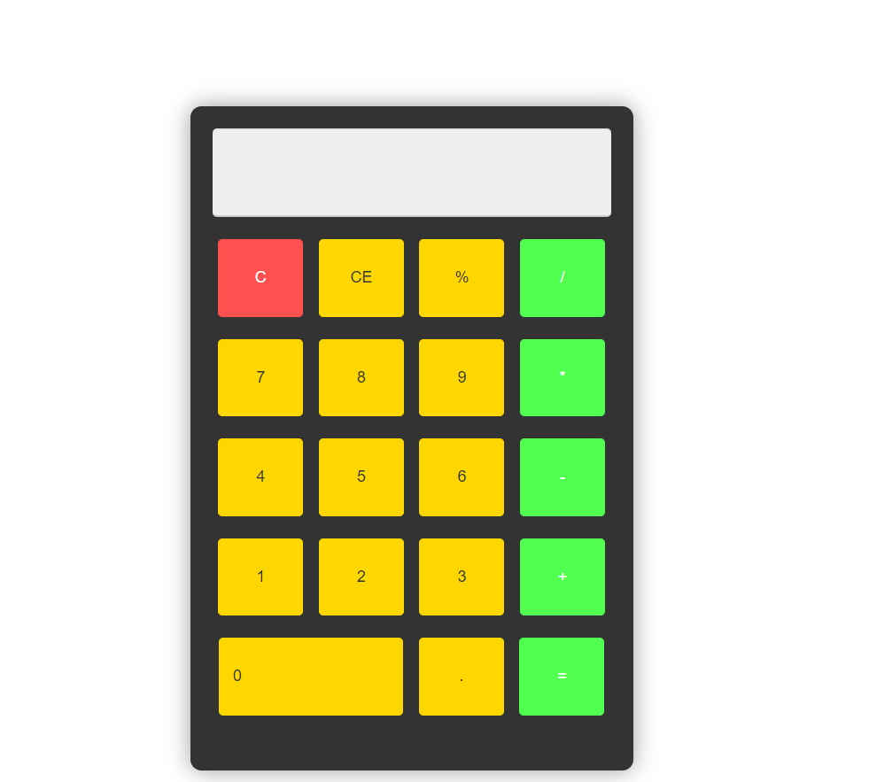
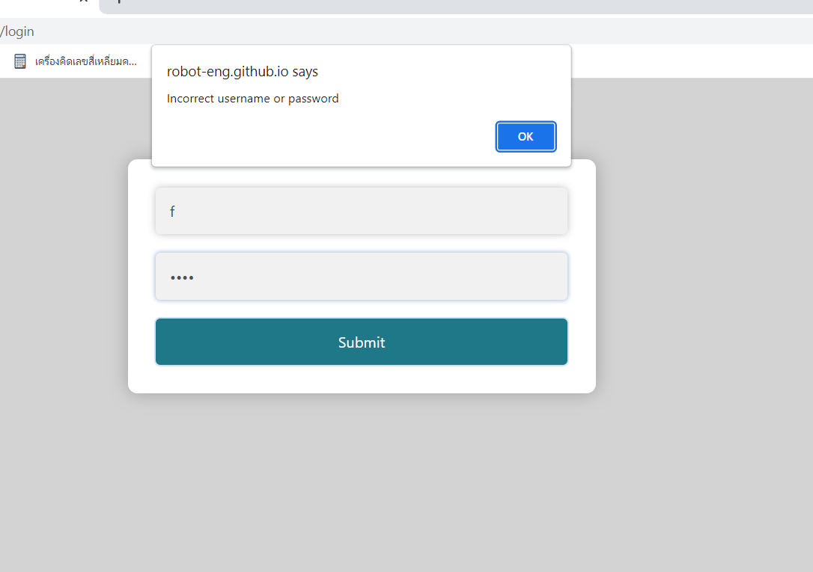

# Oxforee English Learning Hub 🚀

Welcome to the **Oxforee English Learning Hub**, a comprehensive collection of web-based tools designed to help learners master the English language. This project features a detailed English Encyclopedia and interactive vocabulary training systems.

---

## 🌟 Featured Projects

### 📘 1. English Encyclopedia
A deep-dive resource for English learners covering everything from basic grammar to advanced speaking secrets.
- **Web App:** [Open Encyclopedia](https://robot-eng.github.io/web_test.github.io/oxforee/infor.html)
- **11 Essential Sections:**
  1. **Structure & Parts of Speech**: Basic & Advanced classifications.
  2. **Tenses Cheat Sheet**: 12 Tenses with Timeline concepts.
  3. **Question Helper**: Question Tags & sentence structures.
  4. **Modal Verbs**: Nuances of Modals & Past Modals (Should have V3).
  5. **Comparison**: Higher-level comparative structures.
  6. **Prepositions**: Transport logic (In/On) & Confusing pairs.
  7. **Nouns & Quantifiers**: Articles (A/An/The) & Quantity words.
  8. **Contrastive Logic**: Fixing common translation errors and logic gaps.
  9. **If-Clauses & Connectors**: All Conditionals & logical connectors.
  10. **Advanced Grammar**: Gerunds, Participles, Used to/Be used to.
  11. **Speaking & Pronunciation**: Magic E, Phonics, & Casual Slang (Wanna/Gotta).

### 🗂️ 2. Oxford 3000+ Flashcards (v.1)
Master the 3000 most essential English words.
- **Web App:** [Oxford 3000+ v.1](https://word-eng.web.app/)
- **Key Features:**
  - Simple list of 3000 core words.
  - Quick translation and audio on click.

### 🗂️ 3. Oxford 3000+ Flashcards (v.2)
The enhanced learning experience with deep tracking and modern UI.
- **Web App:** [Oxford 3000+ v.2](https://robot-eng.github.io/web_test.github.io/oxforee/index.html)
- **Key Features:**
  - **CEFR Levels**: Track progress from A1 to C1.
  - **Modern UI**: Fully responsive for mobile and desktop.
  - **Pronunciation**: Native Text-to-Speech (TTS) integration.
  - **Integrated Encyclopedia**: Direct access to grammar guides.

---

## 🛠️ Other Mini-Tools
Explore other experimental and utility web apps included in this repository:

| Project | Live Demo |
| :--- | :--- |
| **Logic Gate** | [Logic Gate Media](https://robot-eng.github.io/web_test.github.io/tech_logic/index.html) |
| **Battery App** | [Check Battery Status](https://robot-eng.github.io/web_test.github.io/battery-app/index.html) |
| **Calculator** | [Minimalist Calculator](https://robot-eng.github.io/web_test.github.io/calculator.html) |
| **Time App** | [Digital Clock UI](https://robot-eng.github.io/web_test.github.io/time.html) |

---

## 📸 Screenshots

  
  
  

  
  
  

---

## 🚀 Deployment
This repository is deployed automatically via **GitHub Pages**.

To contribute or run locally:
1. Clone the repository: `git clone https://github.com/robot-eng/web_test.github.io.git`
2. Open any `.html` file in your browser.

Developed with ❤️ for the Global English-Learning Community.
